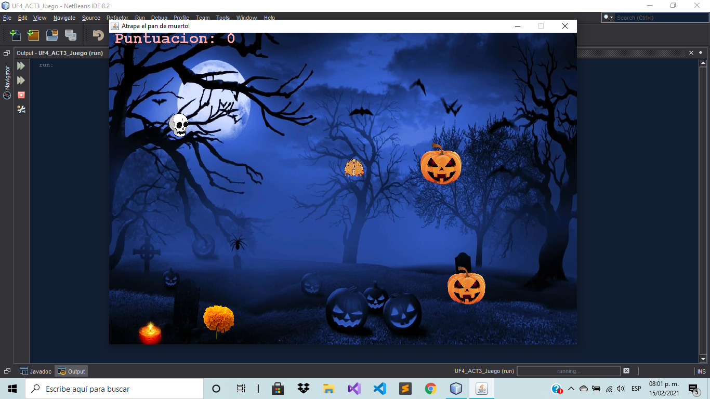

# Juego de dia de muertos

## Atrapa el pan de muerto

Este juego fue creado principalmente para el taller de ejercicios de PROTECO. Es un juego con tematica de dia de muertos cuyo objetivo es atrapar con la calavera el pan de muerto para así obtener la mayor cantidad de puntos. La calavera puede tener 3 estados

- Inmune 
- Mortal
- Muerto

### Inmune

Para ser inmune la calavera deberá tener una puntuación par en el marcador y los objetos como las velas, las flores de cempasúchil, y las calabazas no podran matarlo hasta que la puntuacion vuelva a ser impar. 

	

### Mortal

Cuando la calavera tiene una puntuación impar se volverá mortal y los objetos podrán matarlo. Notemos que la imagen de la calavera cambia cuando se vuelve mortal

	

### Muerto

Cuando la calavera es mortal es decir la puntuación en el marcador es impar, los objetos que choquen con ella podrán matarla. Y si es así entonces pasará al estado de muerto. Podremos presionar la tecla de espacio para volver a jugar

	

